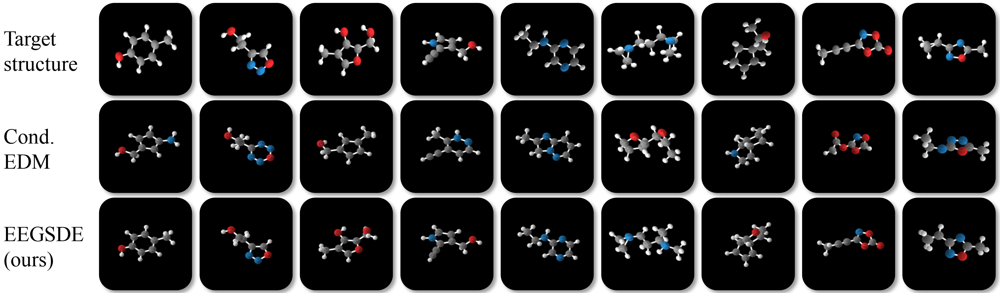

# Equivariant Enengy-guided SDE (EEGSDE) for Inverse Molecule Design
This is the official implementation for [Equivariant Enengy-guided SDE for Inverse Molecule Design](https://arxiv.org/abs/2209.15408). Our related work is [EGSDE: Unpaired Image-to-Image Translation via
Energy-Guided Stochastic Differential Equations](https://github.com/ML-GSAI/EGSDE) (NIPS 2022).
### Overview
In this paper, we propose equivariant energy-guided stochastic differential equations
(EEGSDE), a flexible framework for controllable 3D molecule generation under
the guidance of an energy function in diffusion models. Formally, we show that
EEGSDE naturally exploits the geometric symmetry in 3D molecular conformation, as long as the energy function is invariant to orthogonal transformations. Empirically, under the guidance of designed energy functions, EEGSDE significantly
improves the baseline on QM9, in inverse molecular design targeted to quantum
properties and molecular structures. Furthermore, EEGSDE is able to generate
molecules with multiple target properties by combining the corresponding energy
functions linearly.

### Example Results
#### Generated molecules on QM9 targeted to specific structures:
The molecular structures of EEGSDE align better with target structures then conditional EDM.

#### The ablation studies of energy function:
As the scaling factor grows,
the generated structures align better with the target structure. S = 0 corresponds to the conditional
EDM.

### Dependencies
```
conda create -c rdkit -n EEGSDE rdkit python=3.7
source activate EEGSDE
conda install pytorch==1.11.0 torchvision==0.12.0 torchaudio==0.11.0 cudatoolkit=11.3
pip install msgpack
conda install -c openbabel openbabel
pip install ase==3.19.0
pip install imageio
```
### Pretrained Checkpoints
We provide the pretrained checkpoints and the corresponding args on QM9 dataset [here](https://drive.google.com/drive/folders/13LVo_m0ZWifl94-WmEB0fedeqc8uiX3C). Please put them in the ```pretrained_models/dir```. For example, when generating molecules with desired mu, please put the args and pretrained checkpoints of diffusion models in ```pretrained_models/cEDM_mu```, put the args and pretrained checkpoints of property prediction model used in energy function in ```pretrained_models/predict_mu``` and put the args and pretrained checkpoints of the property prediction model for evaluation in ```pretrained_models/evaluate_mu```.

|  Condition   | Diffusion Models  | Prediction Model in Energy Function  | Prediction Model for Evaluation  |
|  ----  | ----  |----  |----  |
| Cv  | [cEDM_Cv](https://drive.google.com/drive/folders/1DI7H2gQH_1GFDztM8oL1fc9yHaodOwki?usp=share_link) | [predict_Cv](https://drive.google.com/drive/folders/1uzm8-FOWjb5P6VfTJCW6s8ZRw4QlMOP8) | [evaluate_Cv](https://drive.google.com/drive/folders/1RFpa-0zPN4uerXeEYLD582n0Jsz3oj1u?usp=share_link) |
| mu  | [cEDM_mu](https://drive.google.com/drive/folders/1ekwrREpWAdgn5T3OLtuiPQhev5zrS3dZ?usp=share_link) | [predict_mu](https://drive.google.com/drive/folders/1lYDPeTCTKbyST0_VWKoK5k-MNexn1G_C) | [evaluate_mu](https://drive.google.com/drive/folders/179ZZY9a4lICbVIl4IF07FORGtZNLAK94?usp=share_link)|
| alpha  | [cEDM_alpha](https://drive.google.com/drive/folders/1jSok51D98LiYvKSFH4oeMxXDz8ANR7FH?usp=share_link) |[predict_alpha](https://drive.google.com/drive/folders/1Wb2WALcEvYKVhqbgYve4tYKVUNhCY7Wv) | [evaluate_alpha](https://drive.google.com/drive/folders/1NFU-5cnoSAY6P3qT2J8_NOFkXw1n2Dpi?usp=share_link) |
| gap  | [cEDM_gap](https://drive.google.com/drive/folders/1t-PSeetZu2xRkL9Rwophf4nyG4IdouAh?usp=share_link) | [predict_gap](https://drive.google.com/drive/folders/1R-lb1WrBdow4MMmGEajLT3r5k7Fhp1Vn) | [evaluate_gap](https://drive.google.com/drive/folders/1YpESevdv4MJa9wol5DduXNsy1Qy2dtEj?usp=share_link)|
| homo  | [cEDM_homo](https://drive.google.com/drive/folders/1Aoh5GBGf4xdK9XKamI0Q-ONLYcmq5jsi?usp=share_link) | [predict_homo](https://drive.google.com/drive/folders/1s5rmf4zmhhuLGquRnRD4VNCNlqvBVNCa?usp=share_link) | [evaluate_homo](https://drive.google.com/drive/folders/1YpESevdv4MJa9wol5DduXNsy1Qy2dtEj?usp=share_link) |
| lumo | [cEDM_lumo](https://drive.google.com/drive/folders/1hwCUukR_l5NpuvY3BfrFF0S83TYIHNGv?usp=share_link) | [predict_lumo](https://drive.google.com/drive/folders/12VvTbN6ulUIMCbS7X4B_aoiXhRE_XL2O?usp=share_link)| [evaluate_lumo](https://drive.google.com/drive/folders/16C61zDqggRUVp-lMOcTrbgzDZixrA76l?usp=share_link) |
| mu,Cv | [cEDM_mu_Cv](https://drive.google.com/drive/folders/1k-INe4oSR0XCSYu4F3Q3uQDa9kAylMvq?usp=share_link) | - | - |
| gap,mu | [cEDM_gap_mu](https://drive.google.com/drive/folders/1mP0H2q-Slh8BscZONqjWYg2CxZCmqUVH?usp=share_link) | - |- |
| alpha,mu | [cEDM_alpha_mu](https://drive.google.com/drive/folders/1G0_PchELM0tMiE_FYkuJXWMuWTvhSofI?usp=share_link) | - |- |
| fingerprint | [cEDM_fingerprint](https://drive.google.com/drive/folders/1aKoOQ7Cqm9wO4Vy5KWxoulWtnzw34m5S?usp=share_link)| [predict_fingerprint](https://drive.google.com/drive/folders/1MJq9baBtZXcRM1J5cN2muFDjLvPvXjiw) | - |

### Generate molecules with desired single quantum properties

#### Train the time-dependent property prediction model used in energy function
```
python run_train_property_prediction_energy.py --exp_name predict_mu  --conditioning mu --model egnn_dynamics --lr 1e-4 --nf 192 --n_layers 7 --weight_decay 1e-16 --save_model True --diffusion_steps 1000 --sin_embedding False --n_epochs 3000  --diffusion_noise_schedule polynomial_2 --diffusion_noise_precision 1e-5 --dequantization deterministic --include_charges False  --normalize_factors [1,8,1] --dataset qm9_second_half
```
The ```exp_name``` is the name of experiments. The ```conditioning``` is which property to condition and is chosen from ```alpha/homo/lumo/gap/mu/Cv```. Take the above command for example, the results will be saved in ```pretrained_models/predict_mu/```.
#### Run EEGSDE to generate molecules with desired single quantum properties
Take generating molecules with desired mu as an example:
```
python run_EEGSDE_single_property.py --exp_name eegsde_mu --l 1.0 --property mu --generators_path pretrained_models/cEDM_mu/generative_model_ema_2020.npy --args_generators_path pretrained_models/cEDM_mu/args_2020.pickle --energy_path pretrained_models/predict_mu/model_ema_2000.npy --args_energy_path pretrained_models/predict_mu/args_2000.pickle --classifiers_path pretrained_models/evaluate_mu/best_checkpoint.npy --args_classifiers_path pretrained_models/evaluate_mu/args.pickle --batch_size 100 --iterations 100 --save True
```
The ```exp_name``` is the name of experiments. The ```l``` is the scale factor of the energy function. Take the above command for example, the results will be saved in ```outputs/eegsde_mu/l_1.0```.  The ```property``` is which property to condition and is chosen from ```alpha/homo/lumo/gap/mu/Cv```. The ```generators_path``` and ```args_generators_path``` is the path of model and args with conditional EDM.  The ```energy_path``` and ```args_energy_path``` is the path of model and args with property prediction model used in EEGSDE. The ```classifiers_path``` and ```args_classifiers_path``` is the path of model and args with the property prediction model for evaluation. The ```save``` is whether save the generated molecules. The ```batch_size``` is the number of generated molecules each iteration. The ```iterations``` is the number of iterations.

### Generate molecules with desired multiple quantum properties

#### Run EEGSDE to generate molecules with desired multiple quantum properties by combining the corresponding energy functions linearly
Generate molecules with desired alpha and mu:
```
python run_EEGSDE_multi_property.py --exp_name eegsde_alpha_mu --l1 1.5 --l2 1.5 --generators_path pretrained_models/cEDM_alpha_mu/generative_model_ema_2080.npy --args_generators_path pretrained_models/cEDM_alpha_mu/args_2080.pickle --energy_path1 pretrained_models/predict_alpha/model_ema_2000.npy --args_energy_path1 pretrained_models/predict_alpha/args_2000.pickle --energy_path2 pretrained_models/predict_mu/model_ema_2000.npy --args_energy_path2 pretrained_models/predict_mu/args_2000.pickle --classifiers_path1 pretrained_models/evaluate_alpha/best_checkpoint.npy --args_classifiers_path1 pretrained_models/evaluate_alpha/args.pickle --classifiers_path2 pretrained_models/evaluate_mu/best_checkpoint.npy --args_classifiers_path2 pretrained_models/evaluate_mu/args.pickle --batch_size 50 --iterations 200
```
The ```exp_name``` is the name of experiments. The ```l1``` and ```l2``` is the scale factor of the two energy function respectively. Take the above command for example, the results will be saved in ```outputs/eegsde_alpha_mu/l1_1.5_l2_1.5```. The ```generators_path``` and ```args_generators_path``` is the path of model and args with conditional EDM. The ```energy_path1``` and ```args_energy_path1``` is the path of model and args with the first property prediction model used in EEGSDE. The ```energy_path2``` and ```args_energy_path2``` is the path of model and args with the second property prediction model used in EEGSDE. The ```classifiers_path1``` and ```args_classifiers_path1``` is the path of model and args with the first property prediction model for evaluation. The ```classifiers_path1``` and ```args_classifiers_path1``` is the path of model and args with the second property prediction model for evaluation. The ```batch_size``` is the number of generated molecules each iteration. The ```iterations``` is the number of iterations.

Generate molecules with desired gap and mu:
```
python run_EEGSDE_multi_property.py --exp_name eegsde_gap_mu --l1 1.0 --l2 1.0 --generators_path pretrained_models/cEDM_gap_mu/generative_model_ema_1960.npy --args_generators_path pretrained_models/cEDM_gap_mu/args_1960.pickle --energy_path1 pretrained_models/predict_gap/model_ema_2000.npy --args_energy_path1 pretrained_models/predict_gap/args_2000.pickle --energy_path2 pretrained_models/predict_mu/model_ema_2000.npy --args_energy_path2 pretrained_models/predict_mu/args_2000.pickle --classifiers_path1 pretrained_models/evaluate_gap/best_checkpoint.npy --args_classifiers_path1 pretrained_models/evaluate_gap/args.pickle --classifiers_path2 pretrained_models/evaluate_mu/best_checkpoint.npy --args_classifiers_path2 pretrained_models/evaluate_mu/args.pickle --batch_size 50 --iterations 200
```
Generate molecules with desired mu and Cv:
```
python run_EEGSDE_multi_property.py --exp_name eegsde_mu_Cv --l1 1.0 --l2 10.0 --generators_path pretrained_models/cEDM_mu_Cv/generative_model_ema_1820.npy --args_generators_path pretrained_models/cEDM_mu_Cv/args_1820.pickle --energy_path1 pretrained_models/predict_mu/model_ema_2000.npy --args_energy_path1 pretrained_models/predict_mu/args_2000.pickle --energy_path2 pretrained_models/predict_Cv/model_ema_2000.npy --args_energy_path2 pretrained_models/predict_Cv/args_2000.pickle --classifiers_path1 pretrained_models/evaluate_mu/best_checkpoint.npy --args_classifiers_path1 pretrained_models/evaluate_mu/args.pickle --classifiers_path2 pretrained_models/evaluate_Cv/best_checkpoint.npy --args_classifiers_path2 pretrained_models/evaluate_Cv/args.pickle --batch_size 50 --iterations 200
```

### Generate molecules with target structures
#### Train the time-dependent fingerprint prediction model (multi-label classifier) used in energy function
```
python run_train_fingerprint_prediction_energy.py --exp_name predict_fingerprint --model egnn_dynamics --batch_size 128 --lr 1e-4 --nf 192 --n_layers 7 --weight_decay 1e-16 --save_model True --diffusion_steps 1000 --sin_embedding False --n_epochs 3000  --diffusion_noise_schedule polynomial_2 --diffusion_noise_precision 1e-5 --dequantization deterministic --include_charges False --load_charges True --normalize_factors [1,8,1] --dataset qm9
```
The ```exp_name``` is the name of experiments. Take the above command for example, the results will be saved in ```pretrained_models/predict_fingerprint/```.

#### Run EEGSDE to generate molecules with target structures
```
python run_EEGSDE_fingerprint.py --exp_name eegsde_qm9_fingerprint --l 0.5 --generators_path pretrained_models/cEDM_fingerprint/generative_model_ema_1560.npy --args_generators_path pretrained_models/cEDM_fingerprint/args_1560.pickle --energy_path pretrained_models/predict_fingerprint/model_ema_1750.npy --args_energy_path pretrained_models/predict_fingerprint/args_1750.pickle --batch_size 50 --save True 
```
The ```exp_name``` is the name of experiments. The ```l``` is the scale factor of the energy function. Take the above command for example, the results will be saved in ```outputs/eegsde_qm9_fingerprint/l_0.5```. 
The ```generators_path``` and ```args_generators_path``` is the path of model and args with conditional EDM. 
The ```energy_path``` and ```args_energy_path``` is the path of model and args with fingerprint prediction model used in EEGSDE. The ```save``` is whether save the generated molecules.

### Visualize the molecules
```
python run_visualize.py --data_path outputs/eegsde_qm9_fingerprint/l_0.5/samples --save_path outputs/eegsde_qm9_fingerprint/l_0.5/visualize
```
The ```data_path``` is the path of molecules, which are saved as .txt files. The ```save_path``` is the path for saving the visualization results.

### Evaluation using Gaussian software
#### Step 1: run run_gaussian_convert_gjf.py to convert the .txt file, which save the generated molecules, to .gjf file for Gaussian software
```
python run_gaussian_convert_gjf.py --samples_root outputs/eegsde_mu/l_1.0/samples --gif_root outputs/eegsde_mu/l_1.0/gjf
```
The ```samples_root``` is the path for the generated molecules, which are saved as .txt files. The ```gif_root``` is the path for saving the .gjf files.
#### Step 2: use the Gaussian software to compute the properties of generated molecules based on the .gjf files in Step 1
For example, if you have installed the Gaussian software on the Linux server, you can use the run_gaussian_bash.py to analyze the properties of generated molecules, which will generate .log files.
```
python run_gaussian_bash.py --samples_root outputs/eegsde_mu/l_1.0/gjf --save_root outputs/eegsde_mu/l_1.0/gjf_property
```
The ```samples_root``` is the path for the .gjf files in Step 1. The ```save_root``` is the path for saving the outputs of the Gaussian software, which are .log files.

#### Step 3: compute the MAE between properties of generated molecules and desired properties
```
python run_gaussian_evaluation.py --log_root outputs/eegsde_mu/l_1.0/gjf_property --property mu --label_path outputs/eegsde_mu/l_1.0/context.pt
```
The ```log_root``` is the path for the .log files in Step 2. The ```property``` is chosen from ```alpha/homo/lumo/gap/mu```. The ```label_path``` is the path for desired properties.

### Re-training equivariant diffusion model
The code for re-training equivariant diffusion model is available at "Train a Conditional EDM" in [EDM](https://github.com/ehoogeboom/e3_diffusion_for_molecules).
### Re-training the property classifier for evaluation
The code for re-training the property classifier for evaluation is available at "Train a property classifier network" in [EDM](https://github.com/ehoogeboom/e3_diffusion_for_molecules) and we also provide these checkpoints in previous Pretrained Checkpoints section.

### References
If you find this repository helpful, please cite as:
```
@article{bao2022equivariant,
  title={Equivariant Energy-Guided SDE for Inverse Molecular Design},
  author={Bao, Fan and Zhao, Min and Hao, Zhongkai and Li, Peiyao and Li, Chongxuan and Zhu, Jun},
  journal={arXiv preprint arXiv:2209.15408},
  year={2022}
}
```
This implementation is based on [EDM](https://github.com/ehoogeboom/e3_diffusion_for_molecules) and [EGSDE](https://github.com/ML-GSAI/EGSDE).